# Neural Network Architecture Diagrams

## 1. Overall System Architecture

```mermaid
graph TB
    subgraph "Data Generation"
        A[Generate Random Points, X ~ Uniform[0,1]²] --> B[Label by Circle, y = 1 if x₁²+x₂² < 1]
    end

    subgraph "Model Classes"
        C1[NeuralNetworkAdam<br/>Full-Batch]
        C2[NeuralNetworkAdamFullyOptimized<br/>Mini-Batch + Features]
        C3[NeuralNetworkSGDMomentum<br/>Mini-Batch + Momentum]
    end

    subgraph "Training Pipeline"
        D[train method] --> E[Forward Pass]
        E --> F[Loss Computation]
        F --> G[Backward Pass]
        G --> H[Update Parameters]
        H --> I{More Epochs?}
        I -->|Yes| E
        I -->|No| J[Return History]
    end

    subgraph "Prediction"
        K[predict_proba] --> L[Forward Pass Only]
        M[predict] --> N[Forward + Threshold]
    end

    B --> C1 & C2 & C3
    C1 & C2 & C3 --> D
    J --> K & M

    style A fill:#e1f5ff,stroke:#333,stroke-width:2px,color:#000
    style B fill:#e1f5ff,stroke:#333,stroke-width:2px,color:#000
    style C1 fill:#ffe1e1,stroke:#333,stroke-width:2px,color:#000
    style C2 fill:#ffe1e1,stroke:#333,stroke-width:2px,color:#000
    style C3 fill:#ffe1e1,stroke:#333,stroke-width:2px,color:#000
    style D fill:#f0e1ff,stroke:#333,stroke-width:2px,color:#000
    style J fill:#e1ffe1,stroke:#333,stroke-width:2px,color:#000
```

## 2. Neural Network Layer-by-Layer Flow

```mermaid
graph LR
    subgraph "Input Layer"
        X1[x₁]
        X2[x₂]
    end

    subgraph "Hidden Layer Pre-activation"
        S1[s₁ = α₁₀ + α₁₁x₁ + α₁₂x₂]
        S2[s₂ = α₂₀ + α₂₁x₁ + α₂₂x₂]
        S3[...]
        S4[sₐ = αₐ₀ + αₐ₁x₁ + αₐ₂x₂]
    end

    subgraph "Hidden Layer Activation ReLU"
        H1[h₁ = max0, s₁]
        H2[h₂ = max0, s₂]
        H3[...]
        H4[hₐ = max0, sₐ]
    end

    subgraph "Output Layer Pre-activation"
        O[s_out = β₀ + Σₖ βₖ·hₖ]
    end

    subgraph "Output Activation Sigmoid"
        P[p = 1/1+e^-s]
    end

    X1 & X2 --> S1 & S2 & S3 & S4
    S1 --> H1
    S2 --> H2
    S3 --> H3
    S4 --> H4
    H1 & H2 & H3 & H4 --> O
    O --> P

    style X1 fill:#90EE90,stroke:#333,stroke-width:2px,color:#000
    style X2 fill:#90EE90,stroke:#333,stroke-width:2px,color:#000
    style S1 fill:#FFB6C1,stroke:#333,stroke-width:2px,color:#000
    style S2 fill:#FFB6C1,stroke:#333,stroke-width:2px,color:#000
    style S3 fill:#FFB6C1,stroke:#333,stroke-width:2px,color:#000
    style S4 fill:#FFB6C1,stroke:#333,stroke-width:2px,color:#000
    style H1 fill:#87CEEB,stroke:#333,stroke-width:2px,color:#000
    style H2 fill:#87CEEB,stroke:#333,stroke-width:2px,color:#000
    style H3 fill:#87CEEB,stroke:#333,stroke-width:2px,color:#000
    style H4 fill:#87CEEB,stroke:#333,stroke-width:2px,color:#000
    style O fill:#FFD700,stroke:#333,stroke-width:2px,color:#000
    style P fill:#FFA500,stroke:#333,stroke-width:2px,color:#000
```



## 3. Forward Pass Detailed Process

```mermaid
flowchart TD
    A[Input: X n×2] --> B[Matrix Multiply<br/>S_hidden = α @ X^T]
    B --> C[Add Bias<br/>S_hidden += α₀]
    C --> D[ReLU Activation<br/>h = max0, S_hidden]
    D --> E[Matrix Multiply<br/>s_output = β @ h]
    E --> F[Add Bias<br/>s_output += β₀]
    F --> G[Clip for Stability<br/>s_output = clip-500, 500]
    G --> H[Sigmoid Activation<br/>p = 1/1+exp-s]
    H --> I[Cache Values<br/>X, s_hidden, h, s_output, p]
    I --> J[Output: Probabilities n,]

    style A fill:#90EE90,stroke:#333,stroke-width:2px,color:#000
    style D fill:#87CEEB,stroke:#333,stroke-width:2px,color:#000
    style H fill:#FFA500,stroke:#333,stroke-width:2px,color:#000
    style I fill:#FFE4B5,stroke:#333,stroke-width:2px,color:#000
    style J fill:#98FB98,stroke:#333,stroke-width:2px,color:#000
```



## 4. Backward Pass (Backpropagation) Flow

```mermaid
flowchart TD
    A[Input: y_true] --> B[Load Cached Values<br/>X, s_hidden, h, prob]
    B --> C[Output Gradient<br/>∂J/∂s_output = p - y]

    C --> D1[Beta Gradient<br/>∂J/∂β = h @ ∂J/∂s_output / n]
    C --> D2[Beta0 Gradient<br/>∂J/∂β₀ = mean∂J/∂s_output]

    C --> E[Backprop to Hidden<br/>∂J/∂h = β^T ⊗ ∂J/∂s_output]

    E --> F[ReLU Gradient<br/>∂h/∂s = 𝟙s_hidden > 0]

    F --> G[Hidden Gradient<br/>∂J/∂s_hidden = ∂J/∂h ⊙ ∂h/∂s]

    G --> H1[Alpha Gradient<br/>∂J/∂α = ∂J/∂s_hidden @ X / n]
    G --> H2[Alpha0 Gradient<br/>∂J/∂α₀ = mean∂J/∂s_hidden]

    H1 & H2 & D1 & D2 --> I[Return Gradients Dict<br/>α, α₀, β, β₀]

    style A fill:#90EE90,stroke:#333,stroke-width:2px,color:#000
    style C fill:#FFB6C1,stroke:#333,stroke-width:2px,color:#000
    style E fill:#87CEEB,stroke:#333,stroke-width:2px,color:#000
    style G fill:#DDA0DD,stroke:#333,stroke-width:2px,color:#000
    style I fill:#98FB98,stroke:#333,stroke-width:2px,color:#000
```



## 5. Adam Optimizer Update Process

```mermaid
flowchart TD
    A[Input: Gradients g] --> B[Increment Time Step<br/>t = t + 1]

    B --> C1[Update First Moment<br/>m = β₁·m + 1-β₁·g]
    B --> C2[Update Second Moment<br/>v = β₂·v + 1-β₂·g²]

    C1 --> D1[Bias Correction<br/>m̂ = m / 1-β₁^t]
    C2 --> D2[Bias Correction<br/>v̂ = v / 1-β₂^t]

    D1 & D2 --> E[Adaptive Update<br/>θ = θ - η·m̂ / √v̂ + ε]

    E --> F[Updated Parameters<br/>α, α₀, β, β₀]

    style A fill:#90EE90,stroke:#333,stroke-width:2px,color:#000
    style C1 fill:#FFB6C1,stroke:#333,stroke-width:2px,color:#000
    style C2 fill:#87CEEB,stroke:#333,stroke-width:2px,color:#000
    style D1 fill:#DDA0DD,stroke:#333,stroke-width:2px,color:#000
    style D2 fill:#98FB98,stroke:#333,stroke-width:2px,color:#000
    style E fill:#FFA500,stroke:#333,stroke-width:2px,color:#000
    style F fill:#FFD700,stroke:#333,stroke-width:2px,color:#000
```



## 6. SGD with Momentum Update Process

```mermaid
flowchart TD
    A[Input: Gradients g] --> B[Update Velocity<br/>v = γ·v + η·g]

    B --> C[Parameter Update<br/>θ = θ - v]

    C --> D[Updated Parameters<br/>α, α₀, β, β₀]

    style A fill:#90EE90,stroke:#333,stroke-width:2px,color:#000
    style B fill:#FFB6C1,stroke:#333,stroke-width:2px,color:#000
    style C fill:#FFA500,stroke:#333,stroke-width:2px,color:#000
    style D fill:#FFD700,stroke:#333,stroke-width:2px,color:#000
```



## 7. Training Loop Process


## 8. Complete Class Structure


## 9. Data Flow Through Entire System


## 10. Parameter Initialization Strategy

```mermaid
flowchart TD
    A[Initialize Parameters] --> B{Parameter Type?}

    B -->|Weights| C[He Initialization<br/>For ReLU Networks]
    B -->|Biases| D[Zero Initialization]

    C --> E1[Hidden Weights α<br/>~ N0, √2/input_dim]
    C --> E2[Output Weights β<br/>~ N0, √2/hidden_dim]

    D --> F1[Hidden Bias α₀<br/>= 0]
    D --> F2[Output Bias β₀<br/>= 0]

    E1 & E2 & F1 & F2 --> G[Initialize Optimizer State]

    G --> H{Optimizer?}

    H -->|Adam| I[m = 0<br/>v = 0<br/>t = 0]
    H -->|SGD+Momentum| J[v = 0]

    I & J --> K[Ready for Training]

    style A fill:#90EE90,stroke:#333,stroke-width:2px,color:#000
    style C fill:#FFB6C1,stroke:#333,stroke-width:2px,color:#000
    style D fill:#87CEEB,stroke:#333,stroke-width:2px,color:#000
    style G fill:#DDA0DD,stroke:#333,stroke-width:2px,color:#000
    style K fill:#FFD700,stroke:#333,stroke-width:2px,color:#000
```



## Legend

- **Green**: Input/Output
- **Pink**: First moment/momentum operations
- **Light Blue**: Second moment/ReLU operations
- **Purple**: Gradient operations
- **Orange**: Final computations
- **Gold**: Results/Parameters
